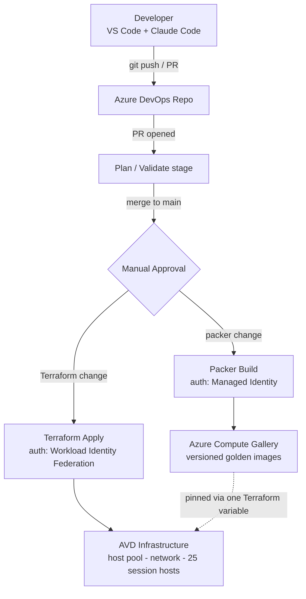

# AVD Lab — Automated Golden-Image Pipeline for Azure Virtual Desktop


A fully automated, end-to-end CI/CD pipeline that builds, versions, and deploys a Windows 11
multi-session golden image to a 25-host Azure Virtual Desktop environment — **zero manual
deployment steps, zero standing cloud credentials, 100% Infrastructure as Code.**

This is a personal Azure lab, built and hardened through real, documented incidents rather than
a tutorial happy-path. Every design decision below traces back to a failure that was hit,
diagnosed, and fixed — see [`/docs`](./docs) for the full incident record.

| | |
|---|---|
| **Session hosts** | 25, pure Entra ID-joined (no domain controller, no hybrid join) |
| **Build agent** | Self-hosted Ubuntu VM, provisioned entirely by Terraform + cloud-init |
| **Standing secrets** | Zero — Workload Identity Federation + Managed Identity, end to end |
| **Golden image build** | ~19 minutes, fully automated from a merged pull request |
| **Rollback** | One Terraform variable, one PR — no rebuild required |

---

## What this is

An engineer-built lab that replicates a production-grade AVD platform-engineering workflow:
Terraform-managed infrastructure, a Packer + Ansible golden-image pipeline, a dedicated
self-hosted Linux build agent, and an authentication model that ends at zero stored secrets
anywhere in the system. It started as a personal challenge — *"build a full CI/CD golden-image
pipeline deploying 25 AVD session hosts, zero manual steps, all IaC"* — and grew into a working
demonstration of how far that requirement can genuinely be pushed.

## Why it's worth a look

- **Zero standing secrets, anywhere.** Terraform authenticates via Workload Identity Federation
  (short-lived OIDC tokens, no stored secret). Packer authenticates via the build VM's own
  Managed Identity (no client ID, no secret, no certificate — the identity *is* the machine).
  The only credential with a shelf life is a bootstrap PAT used once, at first boot, to register
  the agent — and it's gated behind a live validity check before anything trusts it.
- **The build agent is disposable, on purpose.** It's cattle, not a pet: the entire VM —
  packages, tooling, registration, systemd service — is provisioned by one `terraform apply`
  and a self-running cloud-init script. If it dies, it's back in ~10 minutes, from nothing.
- **Rollback is a one-line change.** Session hosts pull their image version from a single
  Terraform variable. Shipping a bad image is a revert-and-reapply, not an incident.
- **Idempotency was a design requirement, not an afterthought.** The entire agent bootstrap
  script is safe to run any number of times — every external tool it calls (`gpg`, `config.sh`,
  `svc.sh`) was audited for what happens on a second run, not just the first.
- **Every failure is documented, with root cause and theory, not just "fixed it."** See
  [Documentation](#documentation) below.

## Architecture



Two independent Terraform stacks, deliberately never sharing state: one for the AVD workload
(host pool, network, session hosts, Key Vault), one for the build agent itself. The only link
between them is a read-only data-source lookup by name — either can be destroyed without
touching the other.

## Tech stack

| Layer | Tools |
|---|---|
| Infrastructure as Code | Terraform (`~> 4.80` azurerm provider) |
| Golden image build | Packer (`azure-arm` builder) + Ansible (WinRM/NTLM provisioner) |
| CI/CD | Azure DevOps Pipelines (YAML), environment-gated approvals |
| Compute | Azure Compute Gallery (versioned images), Azure Virtual Desktop |
| Identity & secrets | Workload Identity Federation, Managed Identity, Azure Key Vault (RBAC) |
| Build agent | Self-hosted Ubuntu 22.04 VM, cloud-init, systemd |
| Assistant tooling | Claude Code (VS Code) for infrastructure and pipeline authoring |

## Repository structure

```
.
├── AVD ALL/                  # Core AVD Terraform stack: host pool, network, session
│                              hosts, Key Vault, Compute Gallery data source
├── packer/                   # Golden-image template + Ansible playbook
│   ├── windows-avd.pkr.hcl
│   └── ansible/playbook.yml
├── build-agent/               # Independent Terraform stack for the self-hosted agent VM
│   ├── vm.tf, network.tf, keyvault.tf, packer-rbac.tf
│   └── cloud-init.yaml        # Runs once, on first boot — registers the agent unattended
├── azure-pipelines.yml        # Terraform Plan / Approval / Apply pipeline
├── image-pipeline.yml         # Packer Validate / Approval / Build pipeline
├── CLAUDE.md                  # Project source of truth: architecture, standing rules,
│                              hard-won lessons, kept current across every change
└── docs/                      # Incident reports + build guide (see below)
```

## How the pipelines work

**`azure-pipelines.yml`** (infrastructure) — PR opens → Plan only. Merge to `main` → Plan again,
then a manual approval gate, then Apply. Authenticates entirely via Workload Identity
Federation; the plan artifact from validation is the exact one applied, never re-planned blind.

**`image-pipeline.yml`** (golden image) — triggers automatically on changes under `packer/**`.
Validate stage fails fast if `packer`, `ansible`, or `pywinrm` are missing from the agent, then
runs `packer validate`. Build stage (approval-gated) builds a temporary Windows VM, configures
it with Ansible, syspreps it, and captures it straight into the Compute Gallery as a new,
strictly-increasing version — authenticated by nothing but the build VM's own identity.

## Authentication model

| Actor | Method | Stored credential |
|---|---|---|
| Terraform (infra pipeline) | Workload Identity Federation (OIDC) | None — short-lived token per run |
| Packer (image pipeline) | System-assigned Managed Identity | None — identity is a property of the VM |
| Build agent → Key Vault (runtime) | Managed Identity | None |
| Build agent registration (one-time, first boot) | Personal Access Token | Yes — in Key Vault, RBAC-protected, fetched only via the VM's own identity |
| Role assignments | Azure RBAC, scoped per resource group | Contributor and Key Vault Secrets User, never subscription-wide |

The one PAT in the system is deliberately the *only* stored secret, exists only to bootstrap a
brand-new agent, and is gated behind a live token-validity check before anything is allowed to
depend on it. Full mapping and the reasoning behind each choice: see the Authentication
reference in [`/docs`](./docs).

## Status

| Phase | Scope | Status |
|---|---|---|
| 1 | AVD infrastructure + CI/CD + Key Vault secrets | ✅ Done |
| 2 | Packer template, Ansible playbook, automated image-build pipeline | ✅ Done |
| 3 | Migrate build agent to a dedicated Azure VM; Managed Identity for Packer | ✅ Done |
| 4 | Branch-policy path filters; PR security gate (TFLint, Checkov, Trivy, Gitleaks) | 🔜 Planned |
| 5 | Image validation/smoke-test stage, drift detection, automated version-bump PRs | 🔜 Planned |
| 6 | Autoscale, Log Analytics/AVD Insights, drain-mode rolling image upgrades | 🔜 Planned |

The fleet currently runs a proven, pinned golden-image version; newer versions built through the
fully-automated Managed-Identity pipeline are validated and ready, with rollout as a deliberate,
separate, reviewable step — see [Rollback](#why-its-worth-a-look) above.

## Documentation

Every non-trivial failure hit while building this was written up in full — symptom, root cause,
fix, and the underlying theory — rather than folded away once it worked:

- **Incident Report 1** — CI agent on a corporate Windows laptop: WSL, git ownership checks,
  PowerShell quoting.
- **Incident Report 2** — Pipeline identity: Workload Identity Federation and Packer's auth
  requirements.
- **Incident Report 3** — Terraform state recovery after a mid-apply failure.
- **Incident Report 4** — Migrating the build agent to Azure: six failures from first boot to a
  green, Managed-Identity-authenticated build.
- **Build Guide** — a from-scratch, step-by-step walkthrough for standing up the same
  self-hosted agent, prerequisites included.
- **Authentication Reference** — Workload Identity Federation, Managed Identity, service
  principals, and PATs, mapped end to end across every actor in the system.

*(Full write-ups live in `/docs` — PDF/Word originals, being converted to Markdown for
in-repo viewing.)*

A few of the sharper lessons, briefly:

- **A stale runbook deleted a service principal mid-project.** The cleanup step had been written
  when that identity was meant to be temporary, and ran again after it was quietly promoted to
  permanent — deleting the SP object (and every role assignment it held) while its Key Vault
  secret lived on, pointing at nothing. Three escalating AAD errors later, root cause was found
  by *measuring* — comparing Key Vault version history against the app's actual credential
  list — not by re-guessing.
- **`git status` said clean; Terraform wanted to destroy the VM anyway.** Terraform hashes a
  template file's raw bytes; git compares line-ending-normalized text. A Windows editor's
  CRLF-only change was invisible to one tool and a full rebuild trigger to the other. Fixed with
  a `.gitattributes` pin — and a footnote worth knowing: a plain `git checkout` on an
  already-"clean" file is a no-op; forcing the rewrite needs a delete-then-checkout.
- **Packer's own error message was incomplete.** It listed which fields to leave unset for
  Managed Identity — and silently omitted one. Trusting the plugin's source over its own error
  text is what actually closed this one out.

## Running this yourself

The `build-agent/` Build Guide in `/docs` covers the self-hosted agent from an empty
subscription to a registered, secret-less VM in about 30 minutes, including the exact
prerequisite steps (agent pool, PAT handling, SSH key) and the two verification gates used
before trusting any of it. The core `AVD ALL/` stack follows the same PR → Plan → Approval →
Apply flow described above.

## License

Not yet set — add a `LICENSE` file to declare terms for reuse.

---

Maintained by [Prakhar Sharma](https://github.com/Prakhar0517).